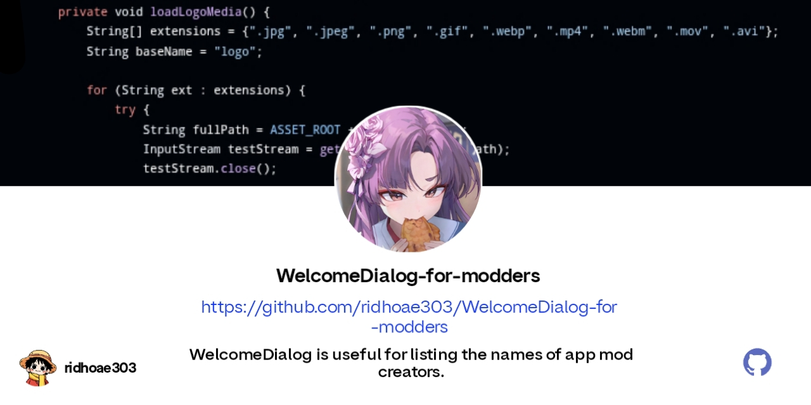

# Welcome Dialog

Experimental Android welcome dialog component written purely in Java.

Simple on the surface, but still packed with enough polish for modders who want a clean custom UI without overcomplicating the setup.

## Introduction

Welcome Dialog is a Java-based experimental project for Android, focused on custom startup dialogs, animated presentation, and lightweight visual styling.

This project was made with a playful but serious mindset: easy to edit, friendly for modders, and still clean enough for developers who care about performance.

It is also the author's first GitHub repository.

[](https://github.com/ridhoae303/WelcomeDialog-for-modders)

# Preview

> **Please see the preview dialog.**


## Project Status

- Newly created
- Experimental
- Open for exploration and modification
- Made for learning, testing, and modding workflows

It does not promise perfection, but it is designed with clear intent.

## Highlights

- Pure Java implementation
- Custom welcome dialog
- Responsive dialog layout
- Logo support
- Banner support
- Custom font support
- Optional fullscreen wallpaper background
- Portrait and landscape wallpaper support
- Rainbow touch drawing effect in `MainActivity.java`
- Lightweight animated background option
- Simple SHA-256 signature check
- Modder-friendly structure

## New Stuff Added

### GPU Animated RGB Smoke Background

`MainActivity.java` now supports a soft animated RGB smoke background using **OpenGL ES 2.0**.

Instead of generating a heavy blurred wallpaper on the CPU, the ambient background effect is rendered through the GPU.  
This helps reduce startup delay and keeps the app from sitting on a black screen while the CPU is busy processing pixels.

The effect is designed to feel:

- Soft
- Colorful
- Neon-like
- Smooth
- Random-looking
- Friendly for cyan, purple, pink, white, and RGB-style themes

### No More Heavy CPU Wallpaper Blur

The old CPU-based wallpaper blur has been removed.

The app no longer needs to create an extra blurred bitmap from the wallpaper, which means:

- Less CPU work
- Less RAM pressure
- Faster startup
- Lower chance of lag on weaker phones
- Cleaner background handling

### Fullscreen Wallpaper Handling

Wallpaper rendering is now made to fill the Activity area properly.

- `wallpaper.jpg` is used for portrait
- `wallpaper2.jpg` is used for landscape
- Wallpaper is displayed fullscreen
- The image is center-cropped to fill the screen
- The app avoids keeping unnecessary duplicate bitmap copies

The goal is simple: make the wallpaper fill the screen nicely without making the CPU work too hard.

### Battery and Performance Friendly Rendering

The animated GPU background is made to stay under control.

- Rendering is limited instead of running wild
- Background rendering pauses when the Activity pauses
- Resources are released when the Activity is destroyed
- Wallpaper bitmap is recycled when no longer needed
- No hidden loop trying to eat RAM forever

Pretty visuals are nice, but cooking the phone is not the plan.

### Original Touch Effect Preserved

The rainbow touch system is still kept.

The touch layer supports:

- Rainbow trails
- Glow particles
- Sparkles
- Smoke particles
- Bubbles
- Ripple effect
- Touch parallax
- Wallpaper zoom on touch

The background was optimized, but the touch feel stays intact.

## Technical Details

- Language: Java only
- Platform: Android
- Minimum Recommendation: Android 9+
- Rendering: Canvas UI + optional OpenGL ES 2.0 background layer
- Device Support: All Android devices, best results on Android 9+
- Orientation Support: Portrait, landscape, tablet, and desktop-like layouts
- Style: **No lambda expression**

## Performance Notes

This project tries to avoid the usual "looks cool but kills the phone" problem.

Current performance direction:

- Avoid CPU bitmap blur
- Avoid decoding more wallpaper bitmaps than needed
- Avoid endless heavy Canvas redraws for the background
- Use GPU shader animation for the ambient RGB smoke layer
- Keep animated background rendering under control
- Clean up bitmap and rendering resources properly

Still, keep your assets reasonable.  
Huge wallpapers, huge GIFs, and massive videos can still hurt performance no matter how clean the code is.

## Use Case

This project is suitable if you are:

- A modder who wants to display a name or identity on the app page
- A developer who wants to experiment with custom Android dialogs
- Someone who wants a Java-only welcome screen
- Someone who wants animated visuals without rewriting everything in Kotlin
- Someone who wants to learn how UI, assets, and simple protection checks can be wired together

## Bug Fixes

Some issues that have been addressed:

- Fixed lag on some devices
- Fixed dialogs silently consuming RAM
- Fixed broken or laggy animations
- Fixed `ScrollView` going out of bounds
- Fixed `clipChildren` issues
- Reduced startup delay caused by heavy background processing
- Removed expensive CPU wallpaper blur
- Improved wallpaper resource cleanup
- Improved background rendering lifecycle handling

## Features Added

> **Touch Rainbow View**

A colorful touch drawing layer was added to `MainActivity.java`.

It supports animated trails, bubbles, glow, smoke, sparkle effects, and light wallpaper motion.

> **OpenGL ES 2.0 RGB Smoke Background**

A soft animated GPU-rendered smoke layer was added behind the wallpaper and UI.  
It is made to look alive without relying on CPU-heavy blur tricks.

> **Responsive Wallpaper System**

Portrait and landscape wallpapers are supported through separate assets, with fullscreen scaling handled by the app.

> **Signature Verification**

A simple SHA-256 signature check is available inside `MainActivity.java`.

## Resource Placement for Dialog

### Logo

> Place the logo in `/assets/ridhoae303/logo`

Supported formats include:

- `.jpg`
- `.jpeg`
- `.png`
- `.gif`
- `.webp`
- `.mp4`
- `.webm`
- `.mov`
- `.avi`

### Banner

> Place the banner in `/assets/ridhoae303/banner`

Supported formats include:

- `.jpg`
- `.jpeg`
- `.png`
- `.gif`
- `.webp`
- `.mp4`
- `.webm`
- `.mov`
- `.avi`

### Font

> Change the font here:

```text
/assets/ridhoae303/ridhoae303.ttf
```

### Background Wallpaper

Portrait wallpaper:

```text
/assets/ridhoae303/assets/wallpaper.jpg
```

Landscape wallpaper:

```text
/assets/ridhoae303/assets/wallpaper2.jpg
```

If you change the file name, update the asset path in `MainActivity.java` too.

## Easy Anti-Tamper Addition

> **Change your SHA-256 signature hash in `MainActivity.java`.**

Find the signature hash check inside `isSignatureValid()` and replace it with your own release signature hash.

Keep in mind: this is a lightweight check.  
Treat it as one layer, not the whole security plan.

## Notes for Modders

A few friendly rules:

- Keep images optimized
- Do not ship massive wallpapers unless you really need them
- Avoid huge GIFs if a small video works better
- Keep custom checks fast
- Do not block the UI thread with heavy work
- Test on a low-end phone, not only on a strong device
- If it feels smooth there, it will usually feel fine everywhere else

## License

This project is licensed under the GNU General Public License v3.

**See the [LICENSE](LICENSE) file for more details.**

## Credits

<p align="center">
  <a href="https://github.com/ridhoae303">
    
  </a>
</p>

### Note from me

> Small project, serious intent.  
> Built for learning, experimenting, and sharing with other modders.
